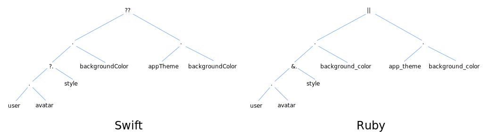

# Niceties for Nil

This assignment examines the conveniences Swift provides for working with nil, and their counterparts in Ruby.

## Part 0: Swift optional desugaring

### Setup

```bash
cd swift-todo
swift test
```

You should see 6 tests run, with one failing:

```
...
OptionalDesugaringTests.swift:61: error: -[OptionalDesugaringTests.OptionalDesugaringTests testAllDesugaringsImplemented] : XCTAssertEqual failed: ("1") is not equal to ("7") - Not all desugarings are implemented yet
...
...other stuff...
...
Test Suite 'OptionalDesugaringTests' failed at 2018-04-24 00:57:59.712.
     Executed 6 tests, with 1 failure (0 unexpected) in 0.234 (0.234) seconds
```

The one failure indicates that you have not yet completed all the desugaring tasks.

If you are on a Mac and you want to use Xcode, run:

```bash
swift package generate-xcodeproj
open OptionalDesugaring.xcodeproj
```

You can run the tests in Xcode with cmd-U.

### Your task

Briefly study the model in `Sources/Model.swift`. This example shows an app in which users may have a custom avatars and theme colors for their profile.

Take a look in `Sources/OptionalDesugaring/ProfileScreen.swift`. This file has a `headerBackgroundColor()` method which returns the user’s custom background color if present, and the app’s default otherwise. The model is contrived so that several different things are optional, but this method correctly handles all of them using Swift’s syntactic sugar.

As with the previous Ruby desugaring exercise, follow the instructions in the comments to remove the sugar.

When you are done, you should see all tests passing.

## Part 1: Ruby nil unbreaking

### Setup

```bash
cd ruby-todo
bundle       # shortcut for `bundle install`
```

Now test:

```bash
bundle exec rake test
```

The tests should **fail**:

```
  1) Error:
Todo list#test_0004_works when no avatar:
NoMethodError: undefined method `background_color' for nil:NilClass
    /Users/paul/work/mac/Programming languages/Homework/hw3-solution/ruby-counterpart/lib/profile_screen.rb:9:in `header_background_color'
    /Users/paul/work/mac/Programming languages/Homework/hw3-solution/ruby-counterpart/test/todo_test.rb:58:in `block (2 levels) in <top (required)>'

  2) Error:
Todo list#test_0005_works when no styles at all:
NoMethodError: undefined method `background_color' for nil:NilClass
    /Users/paul/work/mac/Programming languages/Homework/hw3-solution/ruby-counterpart/lib/profile_screen.rb:9:in `header_background_color'
    /Users/paul/work/mac/Programming languages/Homework/hw3-solution/ruby-counterpart/test/todo_test.rb:64:in `block (2 levels) in <top (required)>'

5 runs, 3 assertions, 0 failures, 2 errors, 0 skips
```

### Your task

Take a look at the implementation of `header_background_color` in `lib/profile_screen.rb`. It looks almost identical to the Swift version! Note that even though Ruby has a very different notion of nil from Swift, it still has close counterparts to Swift’s optional sugar:

- Much like Swift’s `?.`, Ruby’s `&.` operator allows you to traverse properties when the LHS might be nil.
- Much like Swift’s `??`, Ruby’s `||` operator lets you specify a default if the LHS is nil.

However, both of these operators both have subtle differences — and one of them breaks this code!

Ruby’s `||` evaluates to the RHS if the LHS is `nil` _or_ `false`. This can cause problems if `false` means something different than `nil` in a particular context. This isn’t a concern in this particular code, however: the background color won’t be `false`.

No, the problem lies with the `&.` operator, which works slightly differently than Swift’s `?.` despite its similar appearance. Figure out what the difference is. It may help you to think of the Swift and Ruby versions in terms of their (very similar) ASTs, think above what values percolate up the tree, and consider how the `?.` and `&.` operators might work differently:



Fix the Ruby version so the test pass. Hint: Don’t make it complicated! **This requires a _tiny_ change; the fix could not be smaller.**
